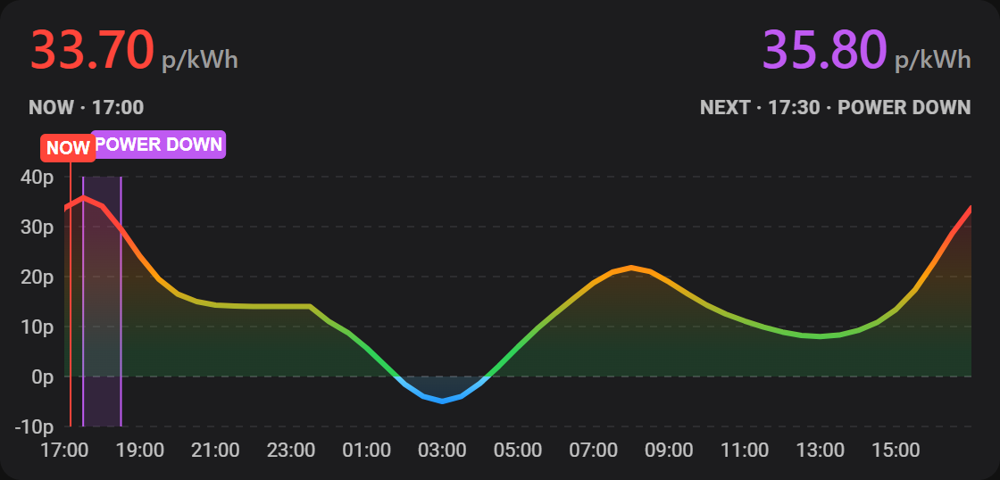
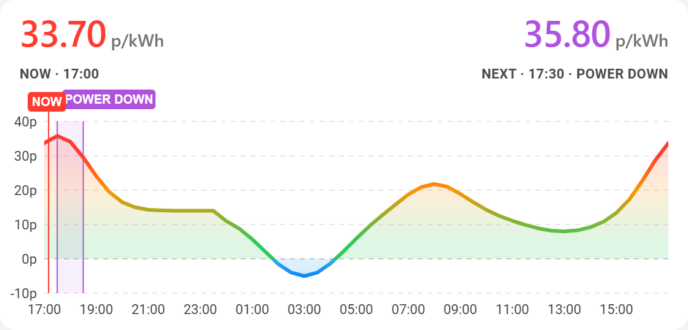

# Energy Price Graph Card

A Home Assistant Lovelace card showing a 24h half-hourly energy price graph, built for the [Octopus Energy integration](https://github.com/BottlecapDave/HomeAssistant-OctopusEnergy).

<p> </p>

- Line and area chart coloured by price: negative is cyan to blue, 0–5p green, 5–20p green to orange, 20–30p orange to red, 30p+ red. Follows the HA dark/light theme.
- Header shows the current price (`NOW · HH:mm`, with `· FREE` at 0p or below) and the next price (`NEXT · HH:mm`).
- Active or upcoming reduced-usage sessions (e.g. Octoplus Power Down) are shaded purple.

## Installation

1. In HACS, open ⋮ → **Custom repositories**.
2. Add `https://github.com/chickenonaraft88/ha-energy-cards` with type **Dashboard**.
3. Install **Energy Price Graph Card** and reload the browser.

## Configuration

Add the card from the dashboard card picker and fill in the visual editor, or use YAML:

```yaml
type: custom:energy-price-graph-card
current_rate_entity: sensor.octopus_energy_electricity_<mpan>_<serial>_current_rate
next_rate_entity: sensor.octopus_energy_electricity_<mpan>_<serial>_next_rate
current_day_rates_entity: event.octopus_energy_electricity_<mpan>_<serial>_current_day_rates
next_day_rates_entity: event.octopus_energy_electricity_<mpan>_<serial>_next_day_rates
incentive_events_entity: event.octopus_energy_<account>_octoplus_power_down_events
```

| Option | Default | Description |
|---|---|---|
| `current_day_rates_entity` | required | Event entity with a `rates` attribute. |
| `next_day_rates_entity` | – | Same, for tomorrow. |
| `current_rate_entity` | from rates | Sensor with the current rate. |
| `next_rate_entity` | from rates | Sensor with the next rate. |
| `incentive_events_entity` | – | Entity with a `joined_events` attribute listing sessions. |
| `incentive_events_attribute` | `joined_events` | Attribute holding the session list. |
| `incentive_label` | `POWER DOWN` | Label for incentive sessions. |
| `predbat_prefix` | _(off)_ | Entity prefix of your Predbat install (usually `predbat`). Draws its planned charge and discharge windows, with target %, in a track under the chart. Reads `best_charge_limit` and `best_export_limit`. |
| `predbat_rates` | `true` | With `predbat_prefix` set, fills the chart after the last published rate (typically tomorrow's, before they are out) with Predbat's predicted rates from `predbat.rates`: a dashed line behind a dotted divider marked `PREDICTED`. `false` turns it off. |
| `free_label` | `FREE` | Header suffix when the price is 0p or below. |
| `unit` | `p/kWh` | Unit shown next to prices. |
| `rate_multiplier` | `100` | Applied to raw values (£ to p). Use `1` if already in pence. |
| `cheap_below` | – | Rates below this (in the card's unit, e.g. `10` for p/kWh or `0.10` for £/kWh) are green. |
| `expensive_above` | – | Rates at or above this are red; rates in between are amber. Setting either option replaces the smooth gradient with these bands. |
| `hours` | `24` | Chart span, from the top of the current hour. |
| `height` | `190` | Chart height in px. |
| `cheapest_window_hours` | _(off)_ | Shades the cheapest contiguous run of this many hours (1-12) in the visible rates. |

Hover over the chart (or tap it on a touch screen) to see a slot's time span and price, whether it falls in an incentive session or is a Predbat prediction, and, with `predbat_prefix` set, what Predbat's plan is doing then. Tap elsewhere to dismiss.

## Development

```sh
npm install
npm run typecheck
npm run build
npm run screenshot
```

`npm run screenshot` renders the card with mock Octopus data (`preview/index.html`) in your local Chrome or Edge and writes PNGs to `preview/out/` (dark, light, mobile width, negative price). To view it live, serve the repo root (e.g. `npx serve`) and open `/preview/index.html?theme=dark`.

### Releasing

The git tag is the version. From an up-to-date `main` (with CI green):

```sh
git tag v0.1.4
git push origin v0.1.4
```

The release workflow sets the package version from the tag, builds, and publishes a GitHub release with generated notes and `energy-price-graph-card.js` attached, which is what HACS installs. No version-bump commit or PR is needed: `package.json` stays at `0.0.0-dev`, and the built card logs the tag's version in the browser console. Tags must look like `vMAJOR.MINOR.PATCH`.

`npm run test:e2e` runs the Playwright tests in `e2e/` against the preview page using your installed Chrome (`PW_CHANNEL=msedge` for Edge).
